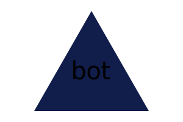

# SVGBONE

## Description

Project name is SVGBONE. The application takes in user prompts to create a logo by taking in 3 characters, color for both text and shape and outputs the result in .svg.

## Table of Contents

- [Installation](#installation)
- [Usage](#usage)
- [License](#license)
- [Contributing](#contributing)
- [Tests](#tests)
- [Questions](#questions)

## Installation

1. Clone the repository: git clone https://github.com/your-username/SVGBONE.git
2. Navigate to the project directory: cd SVGBONE
3. Install dependencies: npm install
4. Start the development server: node undefined.js

## Usage

1.  Input 3 characters to appear in your logo
2.  enter text color as predefined or hexadecimal
3.  Choose the shape of your logo
4.  Enter your shape color

## License

This project is licensed under the MIT license.
[MIT](https://opensource.org/licenses/MIT)

## Contributing

We welcome contributions from the community to improve SVGBONE. To contribute, please follow these steps:

    1. Fork the repository.
    2. Create a new branch: git checkout -b feature/your-feature
    3. Make your changes and commit them: git commit -m "Add new feature"
    4. Push to the branch: git push origin feature/your-feature
    5. Create a pull request, explaining your changes in detail.

## Tests

Run Jest test cases present in the test folder.

## Sample Logo

## Questions

If you have any questions or suggestions regarding SVGBONE, feel free to reach out to our team:

- [GitHub](https://github.com/MwangiR)
